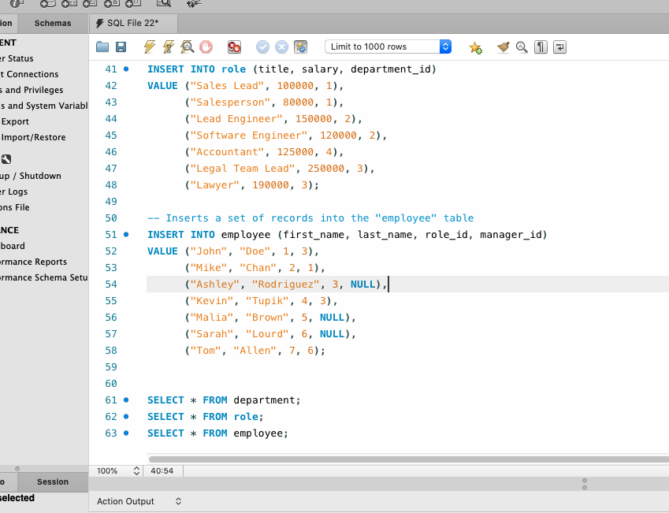

# Employee EZ-Tracker
[](https://opensource.org/licenses/MIT)

## Description
This is a Content Management System app created with node.js, SQL, and inquirer to help companies keep track of their human resources. The app uses relational databases to view and update employee information, such as employee first and last name, id, title, salary, manager and department id. With this app, managing HR has become much easier! Each HR person can view, update and delete information via prompts generated through inquirer. 

## Table of Contents
* [Installation](#Installation)
* [Usage](#Usage)
* [License](#License)
* [Contributing](#Contributing)
* [Test](#Test)
* [Questions](#Questions)

## Installation
This application will be invoked with the following command:
```
Download this github repository by typing `git clone` + `SSH key` in your terminal. Open the app in VS Code or another similar application. Run the seed.sql file in SQL Workbench. Type `node server.js` in terminal. Follow the prompts.
```

## Usage
After installing, use up and down arrows to acces the section that is of interest for you, e.g. View All Employees, Add Employee, Update Employee Role, and more. Enjoy using this app!

<p align="center">

</p>

<p align="center">

</p>

<p align="center">

</p>

<p align="center">

</p>

## License
This application is covered under the MIT license.

## Contributing
If you would like to contribute to this project, please let me know. Contact info below.

## Test
Testing framework used: To be developed.

## Questions
If you have additional questions, you can reach me via my GitHub profile: [piotr72pl](https://github.com/piotr72pl)<br/>
or send me an email at: piotr72@gmail.com
